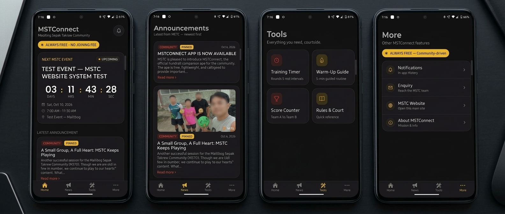

# MSTConnect

**The companion app of the Malitbog Sepak Takraw Community (MSTC).**
*Play. Reconnect. Pass It On.*

MSTConnect puts the community's announcements, events and training tools in your pocket: a news feed, a training timer, a guided warm-up, a score counter and a quick rules reference. It is **free to use, free to build and free to host**: there is no database to pay for and no backend to run.

<div align="center">

[](../../releases/latest)

<sub>*Free & Open Source • Android 8.0+ required*</sub>

</div>




---

## Features

| Tab / screen | What it does |
|---|---|
| **Home** | Latest announcement, the next event (date, time, location and countdown; tap it for details), and quick shortcuts. Pull down to refresh. |
| **News** | All MSTC announcements with photos, categories (Community, Recruitment, Training, Event) and pinned posts. Tap one to read the full post **inside the app**. Pull down to refresh. |
| **Tools** | Four courtside tools, listed below. |
| **More** | Notifications history, Enquiry form, the MSTC website (opens inside the app) and About. |

### Tools

- **Training Timer** — work/rest rounds with presets (5 × 2' / 30", 8 × 1' / 20", 3 × 3' / 60"). Beeps on the last 3 seconds of every period, a rising tone when work starts, a lower tone when rest starts, and a finish melody when the set ends.
- **Warm-Up Guide** — an 18-step, roughly 11-minute head-to-toe routine, with a countdown per step, the same beeps and step-change tones, and previous/next controls.
- **Score Counter** — Team A vs Team B, with editable team names.
- **Rules & Court** — quick reference for rules and court layout.

Sound can be muted with the speaker button in the Timer and Warm-Up headers (the choice is remembered). Sounds play even if the phone is on silent, and don't stop music that is already playing. Each cue also gives a small vibration.

**Screen stays awake** while any of the four tools is open, so the display doesn't dim in the middle of a drill or a match.

### Enquiry

The Enquiry form sends messages to the MSTC team through [Formspree](https://formspree.io) (the form endpoint is set in `frontend/app/enquiry.tsx`).

---

## How it works (no backend needed)

The app reads the **public pages of the MSTC platform**:

```
https://mstc-platform.thereal-jnjnbnd.workers.dev
  /announcements   → News feed, Home, Notifications
  /events          → Next event on Home
```

- It turns those pages into native cards, so anything posted on the website appears in the app.
- Tapping an announcement loads that post's page and shows just its content (title, photos, paragraphs, lists) in a clean in-app reader. If a post can't be read as text, it falls back to showing the page inside the app.
- **Notifications** are built on the phone from the announcements, and read/unread state is kept on the device. There are no accounts, and nothing personal is stored on a server.

To point the app at a different address, change the `EXPO_PUBLIC_API_URL` value in `.github/workflows/build-apk.yml` (or set it as an environment variable when running locally). The default is already the platform above.

> **Heads-up:** because the app reads the website's pages, a big redesign of the website's HTML could affect how cards are read. The reading code is in `frontend/src/api.ts` and is the only place to adjust.

---

## Push notifications (optional, free)

The app can notify members about new announcements and events, plus a "starts in 1 hour" reminder, even when it's closed. It uses Firebase Cloud Messaging and a small separate Cloudflare Worker (`push-worker/worker.js`) that reads the same database as the platform. It never changes the live platform Worker. Setup guide: **[`push-worker/SETUP.md`](push-worker/SETUP.md)**.

Without that setup the app works exactly as before. It just doesn't send notifications.

---

## Get the APK (free, built on GitHub)

The APK is built automatically by **GitHub Actions**. A public repository gets unlimited free builds.

1. Push this project to the `main` branch of a **public** GitHub repository.
2. Open the repo's **Actions** tab. The **Build Android APK** workflow starts by itself (or click it, then **Run workflow**). It takes about 10–20 minutes.
3. When the run shows a green check, open **Releases** (right side of the repo's main page) and download **`MSTConnect.apk`**.
4. Copy the APK to your phone and tap it. If Android asks, allow **Install unknown apps** for your browser or file manager.

Every push that changes anything under `frontend/` builds a new APK as a new release.

### Signing

With no extra setup, the APK is signed with a default debug key. That is fine for installing directly on phones. To use your own signing key, add these four **repository secrets** (Settings → Secrets and variables → Actions) and the workflow will use them automatically:

`KEYSTORE_B64` (your keystore file, base64-encoded) · `KEYSTORE_PASSWORD` · `KEY_ALIAS` · `KEY_PASSWORD`

A properly signed key is also required if you ever publish on Google Play.

### App ID

The Android package is `com.mstc.mstconnect`. It installs as a separate app from the old Emergent-built version, so you can uninstall the old one.

---

## Run it on your computer

Requirements: Node.js 22+.

```bash
cd frontend
npm install --legacy-peer-deps
npx expo install expo-audio expo-keep-awake expo-notifications -- --legacy-peer-deps
npx expo start
```

Then scan the QR code with **Expo Go**, or press `a` for an Android emulator.

`expo-audio` (beeps), `expo-keep-awake` (screen stays on) and `expo-notifications` (push) are installed with `expo install` so you get the versions that match the Expo SDK. The GitHub workflow does the same thing in its install step.

If `npm install` stops on a `cmd-guard` message (a leftover from the Emergent sandbox), run `npm pkg delete scripts.preinstall` first and try again.

---

## Project structure

```
.
├── .github/workflows/build-apk.yml   # builds the APK on GitHub Actions
├── push-worker/                      # optional free push-notification Worker + setup guide
└── frontend/                         # the Expo / React Native app
    ├── app/                          # screens (Expo Router)
    │   ├── (tabs)/                   #   Home, News, Tools, More
    │   ├── tools/                    #   timer, warmup, score, rules
    │   ├── article.tsx               #   in-app post reader
    │   ├── website.tsx               #   in-app website viewer
    │   └── notifications.tsx · enquiry.tsx · about.tsx
    ├── src/
    │   ├── api.ts                    # reads the MSTC pages, builds cards & notifications
    │   ├── sound.ts                  # beeps, haptics, mute setting
    │   ├── push.ts                   # push-notification registration and tap handling
    │   ├── timerLogic.ts             # timer / warm-up counting logic
    │   └── theme.ts                  # colours and spacing
    ├── assets/
    │   ├── images/                   # app icon, adaptive icon, splash, favicon
    │   └── sounds/                   # beep, start, rest, done (.wav)
    └── app.json                      # app name, ID, icon and splash settings
```

---

## What changed from the original Emergent build

The app started life as an Emergent-generated project that depended on Emergent's hosting and credit-limited database. This version was reworked so it runs entirely free:

- **No Emergent, no database.** The FastAPI + MongoDB backend and the Cloudflare/D1 worker are no longer used. The app reads the MSTC platform's public pages instead.
- **Free APK builds** with GitHub Actions (`build-apk.yml`), published automatically to Releases.
- **New app identity.** App ID `com.mstc.mstconnect`, name *MSTConnect*.
- **In-app reading.** Announcements open in a native in-app reader, and the website opens in an in-app viewer, so nothing depends on an external browser. News cards now show photos.
- **Local notifications.** Built from announcements on the device, with read state saved locally.
- **New icon and splash screen** using the MSTC logo (adaptive icon sized to stay inside the safe area).
- **Sound and haptics** on the Training Timer and Warm-Up Guide, with a mute button.
- **Wake lock** on all four tools (Timer, Warm-Up, Score, Rules) so the screen stays on.
- **Event details fixed.** Event date, time (including 24-hour ranges like 07:00–11:30) and location are now read and shown correctly, and past events are no longer shown as "next".
- **Pull to refresh** on Home, News, Notifications and the post reader, plus a reload button in the website viewer.
- **Push notifications (optional).** New announcements, new events and 1-hour event reminders, through a free Cloudflare Worker + Firebase.
- **Cleaner timer logic.** The timer and warm-up counting now lives in `timerLogic.ts` and drives the sound cues.

---

## Known limits

- Content depends on the MSTC platform being online. When there is no connection, the News tab shows an empty state with a link to view announcements inside the app.
- No user accounts and no cloud sync, by design, to keep the app free. Push notifications are optional and need the free setup in `push-worker/SETUP.md`.
- Event date, time and location are read from the layout of the website's Events page. If that layout changes, the reading code in `frontend/src/api.ts` may need a small adjustment.

---

## License

The source code is released under the [MIT License](LICENSE). You are free to use, copy and adapt it, as long as the copyright notice is kept.

The **MSTC name, logo, icon and photos** are not part of that license. They belong to the Malitbog Sepak Takraw Community and may not be reused without permission.

---

## Credits

Built for the **Malitbog Sepak Takraw Community (MSTC)**. Always free to join, always free to use.
